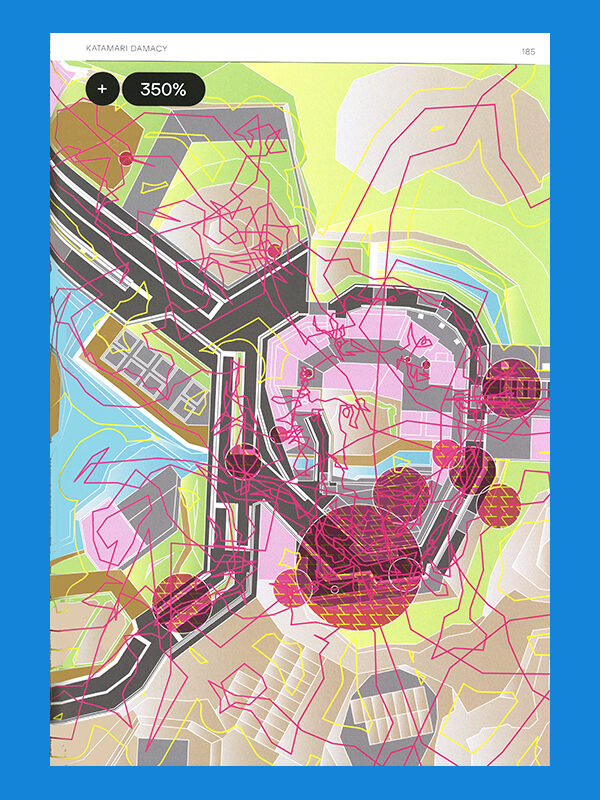
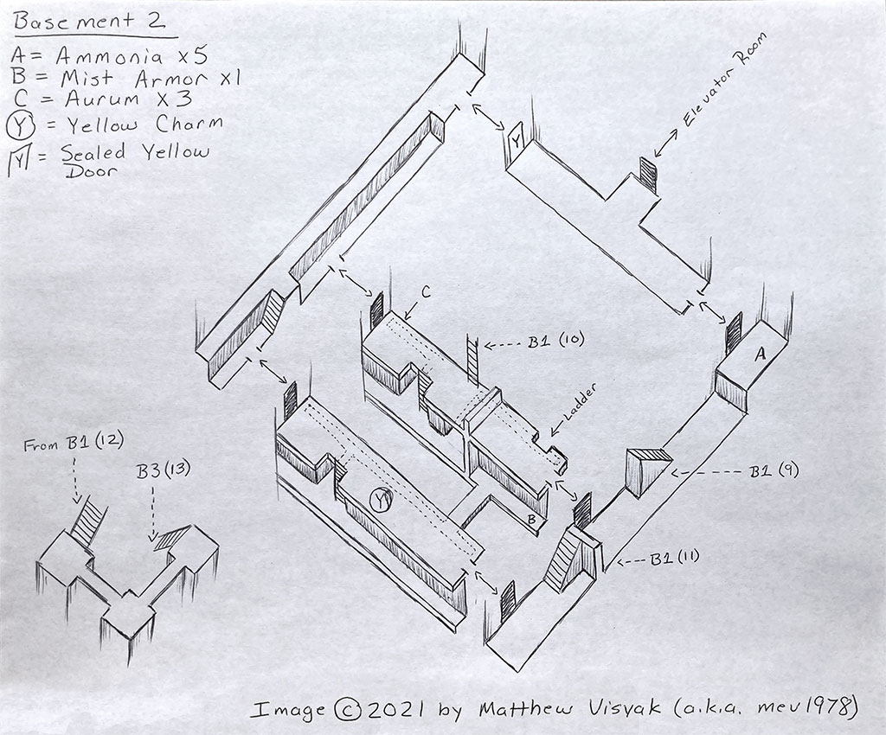

# Subject :

## --- The process & community of video-game cartography ---

###

###### Videogame Atlas, p: 185 Katamari Damacy map
###
---
# Research Question State 1 :

## - How do community-driven map cartography influence the development, longevity, and player engagement in video games ? -

####

---

The 3 main focal points of this subject : 

### Community :

- What motivates players to create and share their own maps?
- What tools are used in digital cartography as a player ?
- How accessible are these tools for the average player versus experienced modders ?
- How does these community work together ?
- For how long have these community been working on theses maps ?
- Why is it important to map virtual worlds ? (Archive ?, Hidden Storytelling ?, etc ... )
- Is it still something relevant to modern video-games due to "Ubisoftification" ?
- What roles do collaboration and competition play in these communities?
- How does video game cartography can create art pieces ?

### Makers :

- How are maps thought of ?
- How to use maps as an immersive tool ?
- How to use maps as a storytelling tool ?
- What makes a good/interesting map ?
- Why are contemporary video-game maps so empty ?
- Why does contemporary video-game maps hide less and less secrets in favour of showing everything ?
- How does map making impact game development ?

### Games :

- How can I join a digital cartographer community ?
- What game should i try to cartograph ?
- How does From-software games brought back the old school maps ?
- How can cartography influence the player community ?
- The different art form of video-game map making (from modding to hand drawn).

---
# Research Plan & Methodology :

####

### 1. Interviews : 
Interviews of different people in digital cartography communities & interviews of game creators about the current state of map making.

Interview methodology for digital cartographers: [Link](https://github.com/chap0ng/md-master-thesis/tree/main/METHOD/24.05.26-interview-comunity)

Interview methodology for game creators: 

Communities list: [Link](https://github.com/chap0ng/md-master-thesis/tree/main/DATA/24.05.16-communities-list)
##

### 2. Content Analysis : 
Examination of the different types and themes of maps created by the community & examination of different types of games and what they produces in map making.

##
### 3. Case studies :
Analysing specific games with big communities ( From Software games, Skyrim, Silent Hill or so ...)

##
### 4. Videogame cartography & participative observation: 
Taking part myself in the creation of a video-game map guide in a game that interest me or even better that hasn't been mapped before. Doing it with either the direct help of a community or by chatting with them on methodologies.

Videogames inventory: [Link](https://github.com/chap0ng/md-master-thesis/tree/main/DATA/24.05.15-videogames-inventory)

---

###### Gamefaqs, map by matthew visyak for breath of fire iv castle basement 2

---
# First Outputs : 

- The video-games inventory !

- Tried reaching my Instagram community -> I got reach by some people that weren't in the field but did gave me contacts that I will be able to reach.

- Got in contact with the game dev [Miller Klitsner](https://millerklitsner.com/) who've sent a general call on his game dev discord server to see if some people are interested in doing tiny interviews.

- Talked to [Plastiboo](https://www.instagram.com/plastiboo/) (amazing artist !) -> Answer, but never did a digital map making, rather an artist and storyteller (they did amazing imaginary game maps for Vermis). Told me to try reaching [Sinclair Lore](https://www.youtube.com/@SinclairLore/featured) that did a huge project on from software maps and wikis.

- Tried reaching [ALT236](https://www.youtube.com/@ALT236) after his last video that had chapters about making a video game cartography -> No answer yet on Instagram, but i'll write to him also on other platform.

---
# Next Steps :

- Reaching out to the [Spriter Resource](https://www.spriters-resource.com/) community.

- Reaching out [Sinclair Lore](https://www.youtube.com/@SinclairLore/featured) about From Software maps mechanics (for Bloodborn or Elden Ring).

- Choosing a game I will be doing cartography for.

- Video-games inventory completion.

---
# Bibliography :

[Link](https://github.com/chap0ng/md-master-thesis/tree/main/DATA/24.05.16-bibliography)

--- 
