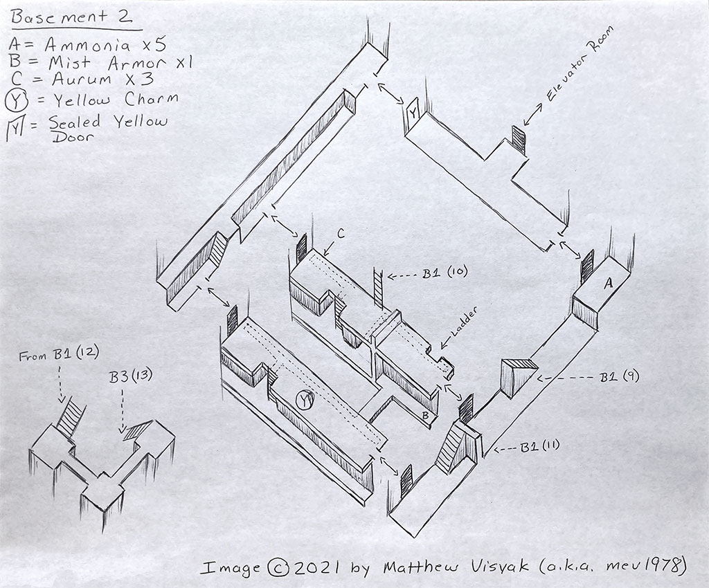

### Subject :

#### --- The process & community of video-game cartography ---

 

---
### Research Question State 1 :

#### - How do community-driven map cartography influence the development, longevity, and player engagement in video games ? -

The 3 main focal points of this subject : 

Community :

- What motivates players to create and share their own maps?
- What tools are used in digital cartography as a player ?
- How accessible are these tools for the average player versus experienced modders ?
- How does these community work together ?
- For how long have these community been working on theses maps ?
- Why is it important to map virtual worlds ? (Archive ?, Hidden Storytelling ?, etc ... )
- Is it still something relevant to modern video-games due to "Ubisoftification" ?
- What roles do collaboration and competition play in these communities?
- How does video game cartography can create art pieces ?

Makers :

- How are maps thought of ?
- How to use maps as an immersive tool ?
- How to use maps as a storytelling tool ?
- What makes a good/interesting map ?
- Why are contemporary video-game maps so empty ?
- Why does contemporary video-game maps hide less and less secrets in favour of showing everything ?
- How does map making impact game development ?

Games :

- How can I join a digital cartographer community ?
- What game should i try to cartograph ?
- How does From-software games brought back the old school maps ?
- How can cartography influence the player community ?
- The different art form of video-game map making (from modding to hand drawn).

---
### Research Plan & Methodology :

##### 1. Interviews : 
Interviews of different people in digital cartography communities & interviews of game creators about the current state of map making.

[I'm an inline-style link with title] (https://github.com/chap0ng/md-master-thesis/tree/main/method/24.05.26-interview-comunity)

Link to interview methodology for game creators: 

##### 2. Content Analysis : 
Examination of the different types and themes of maps created by the community & examination of different types of games and what they produces in map making.

##### 3. Case studies :
Analysing specific games with big communities ( From Software games, Skyrim, Silent Hill or so ...)

##### 4. Videogame cartography : 
Taking part myself in the creation of a video-game map guide in a game that interest me or even better that hasn't been mapped before.

---

### Bibliography :

